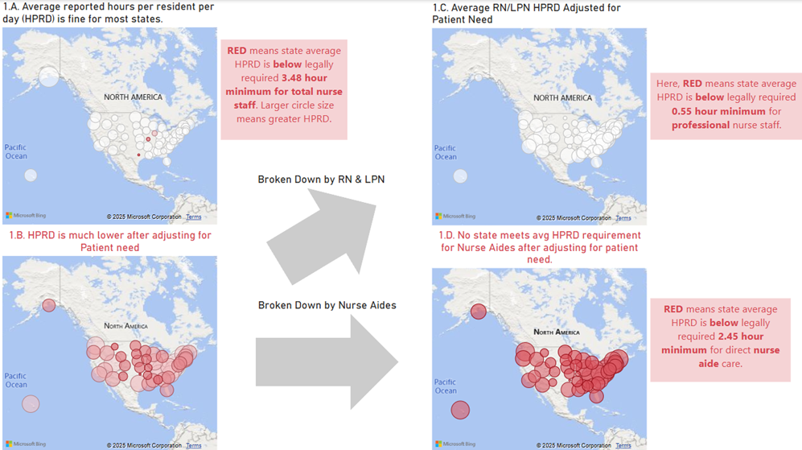
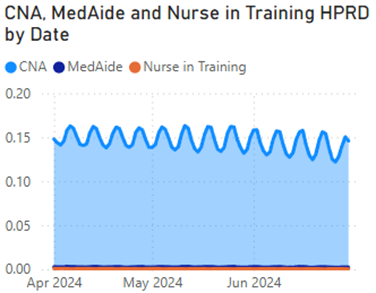
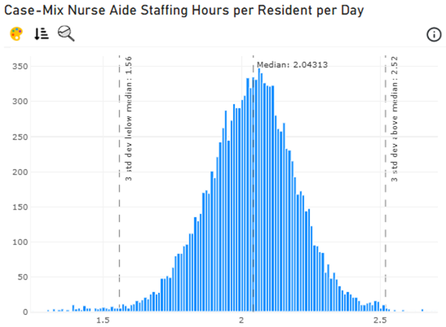
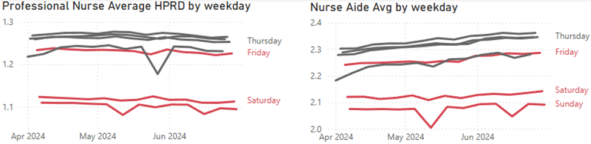
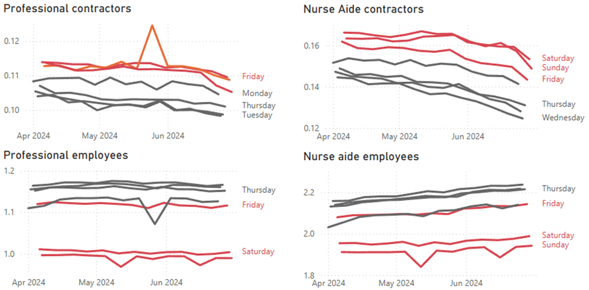
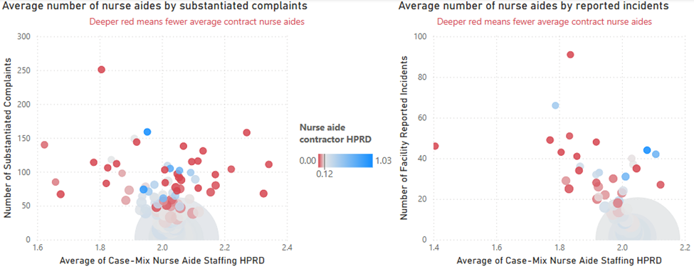
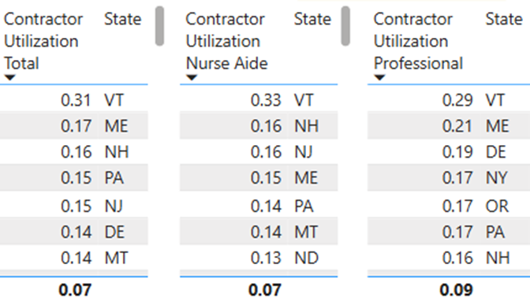
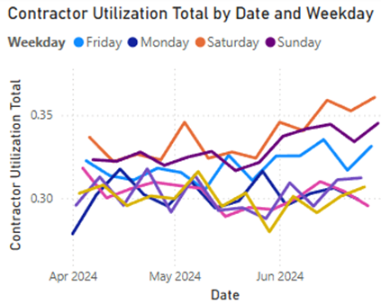
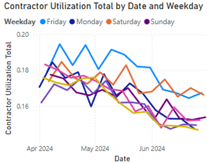

# Clipboard-Health-Nurse-Staffing-Analysis-2024Q2

## Contents

- [Background](#background)
- [Executive Summary](#executive-summary)
- [Technical Details](#technical-details)
  - [HPRD metric](#hprd-metric)
  - [Utilization metric](#utilization-metric)
  - [Provider Information table](#provider-information-table)
  - [Date table](#date-table)
- [Insights Deep Dive](#insights-deep-dive)
  1. [Focus efforts on recruiting Certified Nursing Assistants (CNAs)](#1-focus-efforts-on-recruiting-certified-nursing-assistants-cnas)
  2. [Hire contractors to work primarily on the weekend](#2-hire-contractors-to-work-primarily-on-the-weekend)
  3. [Focus on offering staffing to facilities on the high end of Complaints or Incidents](#3-focus-on-offering-staffing-to-facilities-on-the-high-end-of-complaints-or-incidents)
  4. [Focus recruiting on states with a high contractor utilization percentage](#4-focus-recruiting-on-states-with-a-high-contractor-utilization-percentage)
- [Caveats](#caveats)

## Background

Here at Clipboard Health, we provide staffing to long-term care facilities. The Centers for Medicaid and Medicare Services publish a quarterly report containing daily staffing data for all registered nursing homes in the U.S. This dataset is called Payroll Based Journal (PBJ) Daily Nurse Staffing and can be found here. A few notes:

- Nursing homes are staffed by both employees and contractors. Employees work for the nursing home full time, whereas contractors work for the nursing home on a temporary basis. Most nursing homes are staffed using some combination of full time employees and contractors, but the proportions within each nursing home can vary substantially. All workers from Clipboard Health (and our competitors) are classified as contractors.
- Clipboard Health is a nationwide staffing platform, operating in all 50 states.
- There are a variety of other datasets that can be joined to this dataset, all found under the nursing home data section on CMS’s website.
- As mentioned previously, the PBJ data is separated by quarter. I focus on the second quarter of 2024 (2024Q2).

## Executive Summary

From this brief exploration of the PBJ dataset, I make the following recommendations. I recommend to focus efforts on recruiting Certified Nursing Assistants (CNAs) due to their exceptional need throughout the country compared to professional nurses. Next, I recommend hiring contractors for working primarily on the weekend, as hospitals rely on them over full-time employees for weekends. In addition, focus on offering staffing to facilities that have a high number of complaints or incidents. Finally, I recommend recruiting within states that have an established, high contractor utilization percentage.

## Technical Details

### HPRD metric

An important metric for tracking minimum nurse staffing requirements is the hours per resident day (HPRD), which is the number hours a resident can expect to receive per day from a given position. I thought it valuable to separate professional nurses from nurse aides. So, using the PBJ dataset given, I placed the positions into the following categories:

- Direct registered nurse care: RN, LPN
- Nurse Aide Care: CNA, Nurse Aide in Training (Natrn), Med Aide/Technician (MedAide)
- Mostly Administrative (Not Counted Toward Direct Care): Director of Nursing (RNON), RN with Admin Duties, LPN with Admin Duties

I did not use Mostly Administrative positions to calculate HPRD under the assumption that their responsibilities would not include direct patient care. I used Power BI to create measures for each position, as well as for the above category totals, for only employees, and for only contractors. Here is a sample DAX query for creating the measure for finding the average HPRD for Nurse Aide contractor positions (i.e., including CNAs, Nurse Aides in Training, and Med Aides):

```
HPRD_NURSE_AIDE_CTR_AVG = (SUM(PBJ_DAILY_STAFFING[HRS_CNA_CTR]) + SUM(PBJ_DAILY_STAFFING[HRS_NATRN_CTR]) + SUM(PBJ_DAILY_STAFFING[HRS_MEDAIDE_CTR])) / SUM(PBJ_DAILY_STAFFING[MDSCENSUS])
```

According to the Centers for Medicare and Medicaid Services (CMS, https://www.cms.gov/newsroom/fact-sheets/medicare-and-medicaid-programs-minimum-staffing-standards-long-term-care-facilities-and-medicaid-0), the following requirements are the minimum HPRD for each position:

- 0.55 HPRD of direct registered nurse care (here we use the term professional nurse interchangeably)
- 2.45 HPRD of nurse aide care
- Any combination of either position type to reach a total of 3.48 HPRD

### Utilization metric

Another important metric for our purposes is the Full-Time Employees vs. Contract Staff Utilization. This metric tells us the proportion of staffing hours fulfilled by both. This could give insights into, for example, the impact on quality of care. This is a sample DAX query used to calculate contractor nurse aide utilization ratio:

```
CONTRACTOR UTILIZATION NURSE AIDE = DIVIDE((AVERAGE(PBJ_DAILY_STAFFING[HRS_CNA_CTR]) + AVERAGE(PBJ_DAILY_STAFFING[HRS_MEDAIDE_CTR]) + AVERAGE(PBJ_DAILY_STAFFING[HRS_NATRN_CTR])), (AVERAGE(PBJ_DAILY_STAFFING[HRS_CNA]) + AVERAGE(PBJ_DAILY_STAFFING[HRS_MEDAIDE]) + AVERAGE(PBJ_DAILY_STAFFING[HRS_NATRN])))
```

### Provider Information table

The Provider Information table (https://data.cms.gov/provider-data/dataset/4pq5-n9py) for valuable information regarding the 14,782 providers provides monthly updates, rather than daily. I decided to use from the dataset from June 2024 since Q2 is from April to June. I could simply join this table with the PBJ table using the provider ID numbers, or CMS Certification Number (CCN) from the Provider Information table. I split the table to make it more manageable in the Power BI model into tables with information regarding HPRD, Geography, Quality Rating (5 Star), Rating Cycles Health Survey, and Turnover.

### Date table

In order to analyze date data more effectively, I created a date table using Power BI’s calculated table and calculated column functionality. This way, I was not limited to simply looking at the date but could also slice and dice according to either the month or the day of the week.

## Insights Deep Dive

### 1. Focus efforts on recruiting Certified Nursing Assistants (CNAs)

The HPRD information from the Provider Information table includes an aggregated number of Staffing HPRD for each facility, including category for Case-Mix, which uses CMS’s Minimum Data Set (MDS) to assess resident data for expected care (i.e., resident acuity) based on the complexity of residents' conditions (e.g., health status, care needs, functional abilities).
Using this, we are able to see that the reported average state HPRD appears to be above the legally required 3.48 (see Figure 1.A. below). However, when we swap the reported hours for the adjusted Case-Mix HPRD, we find that the average state HPRD is actually much lower (Figure 1.B. below). I broke this up between professional nursing staff (i.e., RNs and LPNs; Figure 1.C.) and nurse aides (Figure 1.D.):



_Figure 1._

While professional nursing staff needs are typically met (i.e., at least 0.55 HPRD), no state on average has enough hours for nurse aides (i.e., at least 2.45 HPRD).



_Figure 2._

I wanted to see which of the three nurse aide positions was had the most employment. Looking at Figure 2, we can see that certified nurse aides (CNAs) have the vast majority of hours when compared to either nurses in training and medical aides (Natrn and MedAide in the PBJ table, respectively). As we can see from Figure 3, there are only 16 facilities that meet the required 2.55 HPRD for nurse aides!



_Figure 3._

In light of this, when considering which roles to focus recruitment on, CNAs appear to be the most needed. From a marketing perspective, I recommend focusing on facilities that are below the median in HPRD for nurse aide staff, and most especially those under the 3 standard deviations below the median (see Figure 3). From the perspective of the facility, hiring CNAs and nurse aides presents an important challenge, both legally and for tackling the needs of patients. This also presents a ripe opportunity for Clipboard Health.

### 2. Hire contractors to work primarily on the weekend

I used the computed HPRD metric again to compare the usage of professional nurses and nurse aides to see differences across days of the week (Figure 4). I used the date table to visualize HPRD for weekdays on average.



_Figure 4._

Again, I drilled down to see the weekday trends between contractors versus employees in Figure 5. Contractors are employed primarily over the weekend, including Friday. Employees work primarily on weekdays.



_Figure 5._

In other words, employees work less on weekends, which is compensated for by contractors working more on weekends. These numbers are exchanged once the weekday resumes.
Considering this, I recommend hiring contractors who will work primarily on weekends. Although contractors can be hired for weekday shifts, weekends should be the main focus.

### 3. Focus on offering staffing to facilities on the high end of Complaints or Incidents

The Provider Information table also provides measures for the Number of Substantiated Complaints and the Number of Facility Reported Incidents. These are the number of times a complaint or an incident, respectively, resulted in a citation. These are issues related to care, which are likely to be related to staffing numbers. In particular, I wanted to explore the relationship with total nurse aide HPRD and nurse aide contractor HPRD.
In Figure 6, I graphed these against the Average Case-Mix Nurse Aide HPRD. I also added the dimension for Nurse Aide Contractor HPRD by using color—the deeper the red, the lower the HPRD for contractor nurse aides while deeper blue means greater HPRD. Larger bubbles signify a higher concentration of facilities for the particular HPRD and complaint/incident number.



_Figure 6._

The average nurse aide contractor HPRD is 0.12.
We can see that lower contractor HPRD values dominate when number of substantiated complaints is above 50, and the same goes for when the number of reported incidents is greater than about 20. In addition, the vast majority of facilities have no complaints or incidents, and it appears to be due to a) having a good average of total nurse aide HPRD (~2.0) and b) having a decent nurse aide contractor HPRD. There appears to be many more complaints and incidents when the total nurse aide HPRD falls below that 2.0 concentration.

It appears that having less nursing aide staff on average is associated with a greater number of facility reported incidents and substantiated complaints. This is especially true for nurse aide contractors. This relationship makes sense as hospitals currently rely on contractors for weekends, as seen from the previous recommendation, as well as relying on aides for a majority of the hours per resident.

I recommend Clipboard Health to focus on offering staffing to facilities on the higher end of number of Complaints or Incidents for nurse aides. It might be particularly beneficial to focus on those facilities with lower nurse aide contractor HPRD where there would be a very great need.

### 4. Focus recruiting on states with a high contractor utilization percentage

I used the computed Utilization measure to see the states with the highest contractor utilization percentage. These states could indicate where a reliance on contractors is the norm and might potentially help in deciding where to recruit and send our contractors. In Figure 7, I created simple tables to sort the states by greatest contractor utilization, as well as for nurse aides and professional nurses.



_Figure 7._

Contractor utilization percentage is dominated by the northeast for both Professional and Aide workers (see Utilization). Vermont has the highest utilization by far. This is followed by New Jersey, Maine, NJ, Pennsylvania, Delaware, and New York. I recommend to focus recruiting efforts on these states.
I recommend especially to capitalizing on Vermont and Maine; utilization rates are so high that contractors are employed throughout the week, not only on weekends, as seen in Figure 8. Looking at the first recommendation, we could potentially explore other lower-utilization states, but these would likely have to focus on weekends.

 

_Figure 8. Vermont (top) and Maine (bottom)._

## Caveats

- In my brief research of the CMS website, I did not find how this value is specifically calculated. Looking at the first recommendation, we can explore how case-mix is calculated to further target hospitals that have greater need.sdf
- The Provider Information table is not fine-grained and is only an aggregate measure for this current period. A table that would go into daily measurements would allow exploring areas. For example, we could consider prioritizing facilities with recurring complaints and incidents.
